# TraceLens AI

**AI-Powered Digital Forensics & Incident Response Platform**

[](https://tracelens-ai-one.vercel.app)
[](#)
[](#license)
[](#)
[](#)

TraceLens AI is an enterprise-grade Digital Forensics and Incident Response (DFIR) platform that unifies case management, evidence handling, AI-assisted analysis, incident response, and court-ready reporting into a single, secure environment.

---

## Live Deployment & Repository

| Resource | Link |
|---|---|
| Live Application | [tracelens-7bs8163lx-sami-nova.vercel.app](https://tracelens-ai-one.vercel.app) |
| Production URL (alias) | [tracelens-ai-one.vercel.app](https://tracelens-ai-one.vercel.app) |
| GitHub Repository | [github.com/SAMINA-PARVEEN/tracelens-ai](https://github.com/SAMINA-PARVEEN/tracelens-ai) |
| Developer | Samina Parveen (SamiNova) |

---

## Table of Contents

- [Introduction](#introduction)
- [Vision & Mission](#vision--mission)
- [Background & Problem Statement](#background--problem-statement)
- [Project Objectives](#project-objectives)
- [Technology Stack](#technology-stack)
- [System Architecture](#system-architecture)
- [Database Architecture](#database-architecture)
- [Security Architecture](#security-architecture)
- [AI Architecture](#ai-architecture)
- [Deployment Guide](#deployment-guide)
- [API Documentation](#api-documentation)
- [Testing Strategy](#testing-strategy)
- [Performance & Scalability](#performance--scalability)
- [Future Roadmap](#future-roadmap)
- [Glossary](#glossary)
- [References](#references)
- [Application Screenshots](#application-screenshots)
- [License](#license)
- [Contact](#contact)

---

## Introduction

### Overview

TraceLens AI is an enterprise-grade Digital Forensics and Incident Response (DFIR) platform designed to streamline the complete lifecycle of digital investigations. The platform integrates evidence management, forensic analysis, artificial intelligence, incident response, and professional reporting into a unified environment.

| Attribute | Details |
|---|---|
| Version | 1.0.0 |
| Status | Live — Production Ready |
| Developer | Samina Parveen (SamiNova) |
| License | MIT License |

### Quick Access

| Service | URL |
|---|---|
| Live App | https://tracelens-ai-one.vercel.app |
| Alias | https://tracelens-ai-one.vercel.app |
| Source Code | https://github.com/SAMINA-PARVEEN/tracelens-ai |

### Core Capabilities

| Feature | Description |
|---|---|
| Case Management | Create and manage investigation cases |
| Evidence Upload | Upload digital evidence securely |
| Hash Verification | SHA-256 cryptographic hashing |
| Metadata Extraction | Extract metadata from multiple file formats |
| AI Analysis | Log analysis, email analysis, OSINT investigations |
| Timeline Reconstruction | AI-assisted chronological event mapping |
| Professional Reports | Generate court-ready PDF reports |
| Incident Response | Structured incident response workflows |

---

## Vision & Mission

### Vision

TraceLens AI aims to become a comprehensive digital investigation platform capable of supporting investigators throughout every stage of the forensic lifecycle while leveraging artificial intelligence to improve productivity, reduce repetitive manual work, and enhance investigation quality.

Rather than replacing forensic experts, TraceLens AI functions as an intelligent assistant that augments investigator capabilities by automating routine tasks, identifying patterns, summarising findings, and maintaining accurate documentation — for enterprise organisations, educational institutions, cybersecurity teams, law enforcement agencies, and independent forensic professionals alike.

### Mission

To develop an intelligent, secure, and scalable DFIR platform that combines traditional forensic methodology with artificial intelligence, while preserving evidence integrity, legal admissibility, and professional investigative standards — simplifying complex investigations without compromising forensic principles or investigator control.

### Core Principles

| Principle | Description |
|---|---|
| Evidence Integrity | Every uploaded file is protected through cryptographic hashing and integrity verification. |
| Transparency | Every action is traceable through audit logs, activity records, and chain-of-custody documentation. |
| Security | Sensitive data is protected via authentication, authorisation, database policies, and encrypted communication. |
| Scalability | Modular architecture supports future expansion without redesign. |
| Intelligence | AI enhances investigator productivity while investigators retain full control over decisions. |
| Professional Reporting | Reports meet organisational requirements and support legal admissibility. |

---

## Background & Problem Statement

### Current Challenges in Digital Forensics

**Fragmented investigation workflow.** Investigators rely on multiple independent tools that rarely communicate with one another, requiring manual transfer of information between systems.

| Impact | Description |
|---|---|
| Duplicate documentation | Same information entered multiple times across tools |
| Inconsistent evidence records | Different tools store different versions of evidence |
| Increased investigation time | Switching between tools consumes significant time |
| Higher operational complexity | Maintaining multiple tools requires additional training |
| Reduced collaboration | Team members cannot easily share findings across tools |

**Increasing volume of digital evidence.** A single investigation may involve thousands of log entries, hundreds of emails, large document collections, images, videos, audio, cloud records, network captures, and mobile device data.

**Evidence integrity.** Preserving unaltered evidence requires cryptographic hashing, integrity verification, secure storage, controlled access, and comprehensive audit trails.

**Chain of custody management.** A legally defensible investigation must document who collected evidence, when, where it was stored, who accessed it, why, whether it was modified, and when it was transferred.

**Manual documentation.** Investigators must prepare investigation notes, evidence inventories, metadata summaries, timelines, technical findings, incident response reports, executive summaries, and court reports — largely by hand in traditional workflows.

**Limited AI integration.** Most existing forensic platforms provide minimal AI functionality or require separate, disconnected AI tools.

**Collaboration challenges.** Large investigations involving multiple investigators struggle to coordinate tasks, share findings, and track progress without centralised management.

**Incident response complexity.** Response teams often document activity across disconnected ticketing systems, spreadsheets, and reporting tools.

### Research Gap

Few platforms integrate case management, evidence management, artificial intelligence, incident response, reporting, and enterprise investigation workflows into a single cohesive environment. Most tools specialise in individual forensic activities rather than the complete investigation lifecycle.

### Expected Benefits

| Category | Benefits |
|---|---|
| Operational | Centralised workflow, reduced investigation time, improved collaboration, automated documentation, simplified evidence management |
| Technical | Secure storage, automatic SHA-256 hashing, metadata extraction, AI-assisted analysis, modular and scalable architecture |
| Legal | Complete chain of custody, professional and court-admissible reporting, full audit logging, evidence integrity verification |
| Organisational | Increased productivity, standardised procedures, better compliance, improved reporting quality, reduced complexity |

---

## Project Objectives

### Primary Objective

Design and develop an enterprise-grade DFIR platform that enables investigators to manage the complete digital investigation lifecycle through a secure, intelligent, scalable, and user-friendly web application — centralising evidence management, investigation workflows, AI, incident response, and reporting while preserving internationally recognised forensic principles.

### Secondary Objectives

**Digital Evidence Management** — a structured system for secure storage, cryptographic hashing, and comprehensive metadata management across file formats.

**Case Management** — create, organise, manage, and monitor investigations, each maintaining its own evidence, reports, tasks, timelines, and documentation.

**Artificial Intelligence Integration** — AI assists rather than replaces investigators:

| AI Function | Description |
|---|---|
| Investigation Summaries | Automatically generate case summaries |
| Email Analysis | Analyse email headers and content |
| Log Analysis | Review system logs for anomalies |
| Metadata Interpretation | Explain forensic metadata |
| Timeline Generation | Auto-generate event timelines |
| Incident Response Recommendations | Suggest response actions |
| Report Drafting Assistance | Help write professional reports |

**Incident Response Support** — structured workflows for Identification, Containment, Eradication, Recovery, and Lessons Learned.

**Professional Reporting** — reports include case information, evidence summary, chain of custody, hash verification, metadata findings, timeline, AI findings, investigator conclusions, and recommendations.

**Security** — authentication, authorisation, role-based permissions, secure database policies (RLS), audit logging, activity monitoring, and secure evidence storage.

**Scalability** — modular architecture supporting future modules such as memory forensics, malware analysis, network forensics, mobile forensics, cloud forensics, threat intelligence, and IOC management.

### Project Scope

#### In Scope

| Feature | Description |
|---|---|
| User Authentication | Registration, login, password reset, secure sessions, profile management |
| Organisation Management | Organisation profiles, settings, multi-user environment |
| Case Management | Create, update, archive cases, assign investigators, track progress |
| Evidence Management | Upload, store, hash, categorise, tag evidence |
| Metadata Extraction | Images, documents, PDFs, videos, audio, archives |
| Chain of Custody | Complete evidence history — timestamps, investigators, transfers, access |
| Artificial Intelligence | Log/email analysis, metadata interpretation, timeline assistance, summaries |
| Timeline Reconstruction | Auto-generated chronological event sequences |
| Incident Response | Detection, analysis, containment, recovery, lessons learned |
| Reporting | Court, executive, technical, evidence, and timeline reports |
| Audit Logging | Logins, evidence uploads, report generation, AI analysis, verification |
| Notifications | Case updates, evidence uploads, AI completion, approvals, task assignments |

#### Out of Scope

| Feature | Description |
|---|---|
| Hardware Acquisition | Disk imaging, memory acquisition, mobile extraction, live system acquisition |
| Network Packet Capture | Live network traffic capture |
| Malware Sandbox | Automated malware execution in isolated environments |
| Live Threat Detection | Replacement for SIEM or EDR systems |

---

## Technology Stack

### Frontend

| Technology | Version | Purpose |
|---|---|---|
| Next.js | 15 | React framework with App Router |
| React | 19 | User interface development |
| TypeScript | Latest | Strongly typed development |
| Tailwind CSS | Latest | Utility-first styling |
| shadcn/ui | Latest | Accessible UI components |
| Lucide React | Latest | Icons |
| Framer Motion | Latest | Animations |
| React Hook Form | Latest | Form handling |
| Zod | Latest | Form validation |

### Backend

| Technology | Purpose |
|---|---|
| Supabase | Backend-as-a-Service platform |
| PostgreSQL | Relational database |
| Supabase Authentication | User authentication |
| Supabase Storage | Evidence storage |
| Row Level Security (RLS) | Database security |
| Edge Functions | Server-side processing |

### Artificial Intelligence

| Technology | Purpose |
|---|---|
| Grok AI API | AI-powered forensic analysis |

| Capability | Description |
|---|---|
| Evidence Summarisation | Generate case summaries |
| Metadata Interpretation | Explain forensic metadata |
| Email Analysis | Analyse email headers and content |
| Log Analysis | Review system logs |
| Timeline Explanation | Reconstruct event sequences |
| Executive Summary Generation | Create professional summaries |
| Report Drafting | Assist with report writing |
| Incident Recommendations | Suggest response actions |

### Development Tools

Visual Studio Code · Git · GitHub · Postman · pgAdmin · Supabase Dashboard · Vercel

---

## System Architecture

### High-Level Architecture

```
                         End User
                   Investigator / Analyst
                           │
                           ▼
                  Next.js 15 Frontend
            React • TypeScript • Tailwind CSS
                           │
                           ▼
              Authentication & Middleware
                JWT • RBAC • Session Control
                           │
                           ▼
                    Backend Services
        Cases • Evidence • Reports • AI • Timeline
                           │
            ┌──────────────┼──────────────┐
            ▼              ▼              ▼
       PostgreSQL   Supabase Storage   Grok AI API
      (30 Tables)   (Evidence Files)  (AI Analysis)
            │              │              │
            └──────────────┼──────────────┘
                           ▼
                Court-Admissible Reports
```

### Architectural Layers

| Layer | Responsibility | Technologies |
|---|---|---|
| Presentation | User interfaces, dashboards, forms | Next.js, React, Tailwind CSS |
| Application | API routes, validation, error handling | Next.js API Routes, TypeScript |
| Business Logic | Case management, evidence processing | TypeScript services |
| AI Processing | LLM integration, prompt engineering | Grok AI API |
| Database | PostgreSQL, Supabase Storage | Supabase, PostgreSQL |
| Security | Authentication, RBAC, RLS, audit logging | Supabase Auth, RLS |

### Component Architecture

```
Dashboard          Cases             Evidence           Reports          AI Assistant
├── Statistics     ├── Members       ├── Hashes         ├── Templates    ├── Metadata Analysis
├── Activity Feed  ├── Evidence      ├── Metadata       ├── Sections     ├── Email Analysis
├── Notifications  ├── Timeline      ├── AI Analysis     ├── Versions     ├── Log Analysis
├── Timeline View  ├── Reports       ├── Chain of        ├── Approvals    ├── OSINT Analysis
└── Charts         └── Tasks         │   Custody         └── PDF Export   └── Report Drafting
                                     └── Attachments
```

### Data Flow

```
Create Case → Upload Evidence → Store File (Supabase Storage) → Generate SHA-256 Hash
    → Extract Metadata → Store Metadata → Run AI Analysis → Store AI Findings
    → Generate Timeline → Generate Report → Approval → Export PDF → Archive Investigation
```

### Authentication Flow

```
User Login → Supabase Authentication → JWT Token → Session Created
    → Role Verification → Load Dashboard → Access Granted
```

---

## Database Architecture

TraceLens AI runs on **30 interconnected tables** organised into six logical modules.

| Module | Tables | Purpose |
|---|---|---|
| Core Management | `organizations`, `profiles`, `cases`, `case_members` | Organisations, users, investigations |
| Evidence Management | `evidence`, `evidence_hashes`, `evidence_metadata`, `chain_of_custody`, `attachments` | Evidence storage, hashing, metadata |
| AI & Analysis | `ai_analysis`, `metadata_analysis`, `email_analysis`, `log_analysis`, `osint_analysis` | AI-generated findings |
| Incident Response | `incidents`, `investigation_tasks`, `timeline_events` | Incident tracking, task management |
| Reporting | `reports`, `report_templates`, `report_sections`, `report_versions`, `report_approvals` | Report generation, versioning, approvals |
| Security & Monitoring | `audit_logs`, `activity_logs`, `notifications`, `system_settings`, `organization_settings`, `user_preferences`, `evidence_tags`, `case_tags` | Auditing, notifications, configuration |

### Entity Relationships

```
Organizations → Users → Cases
                          ├── Evidence → Hashes, Metadata, Chain of Custody
                          ├── Reports → Templates, Sections, Versions, Approvals
                          ├── Timeline Events
                          ├── AI Analysis
                          └── Audit Logs
```

### Module 1 — Core Management

**`organizations`** — id, name, email, phone, address, website, created_at

**`profiles`** — id, full_name, email, phone, role, organization_id, created_at

| Role | Permissions |
|---|---|
| Super Administrator | Full platform access |
| Organization Administrator | Manage organisation and users |
| Lead Investigator | Create and manage investigations |
| Digital Forensic Analyst | Analyse evidence |
| Incident Responder | Respond to incidents |
| Reviewer | Review and approve reports |
| Observer | Read-only access |

**`cases`** — id, case_id, title, description, priority, status, organization_id, created_by, created_date, closed_date

| Status | Description |
|---|---|
| Draft | Initial creation |
| Open | Active investigation |
| Under Investigation | Ongoing analysis |
| Evidence Collection | Gathering evidence |
| Analysis | Analysing evidence |
| Report Writing | Preparing report |
| Review | Under review |
| Approved | Approved |
| Closed | Investigation complete |
| Archived | Archived for records |

### Module 2 — Evidence Management

**`evidence`** — id, evidence_id, case_id, file_name, file_size, file_type, storage_path, uploaded_by, uploaded_at, evidence_category, description

| Category | Examples |
|---|---|
| Documents | PDF, Word, Excel, Text |
| Images | JPEG, PNG, TIFF, GIF |
| Videos | MP4, AVI, MOV |
| Audio | MP3, WAV, M4A |
| Email Files | EML, MSG, PST |
| Log Files | Event logs, Syslog |
| Memory Dumps | RAM captures |
| Disk Images | E01, DD, Raw |
| Mobile Extractions | iOS, Android |
| Network Captures | PCAP, PCAPNG |
| Archives | ZIP, RAR, 7Z |

**`evidence_hashes`** — id, evidence_id, algorithm, hash_value, generated_at, verified_at

**`evidence_metadata`** — id, evidence_id, metadata_type, metadata_key, metadata_value, extracted_at

**`chain_of_custody`** — id, evidence_id, user_id, action, timestamp, location, notes

| Custody Action | Description |
|---|---|
| Collected | Evidence collected |
| Uploaded | Uploaded to system |
| Verified | Integrity verified |
| Accessed | Accessed by investigator |
| Downloaded | Downloaded from system |
| Transferred | Transferred to another investigator |
| Analysed | Analysed during investigation |
| Reviewed | Reviewed for report |
| Archived | Archived for records |
| Exported | Exported for legal proceedings |
| Presented | Presented in court |

### Module 3 — Artificial Intelligence & Analysis

**`ai_analysis`** — id, case_id, evidence_id, analysis_type, prompt_version, ai_model, generated_summary, findings, recommendations, confidence_score, generated_at, reviewed_by

| Analysis Type | Description |
|---|---|
| Evidence Summary | Summarise evidence |
| Investigation Summary | Summarise investigation |
| Executive Summary | Executive-level summary |
| Technical Findings | Technical analysis |
| Risk Assessment | Risk evaluation |
| Timeline Explanation | Timeline explanation |
| Incident Summary | Incident documentation |

**`metadata_analysis`** — id, evidence_id, metadata_category, interpretation, suspicious_findings, confidence

**`email_analysis`** — id, evidence_id, sender, recipient, subject, date, spf_status, dkim_status, dmarc_status, attachment_count, suspicious_urls, phishing_indicators, risk_score, ai_summary

| Risk Level | Description |
|---|---|
| Informational | No risk |
| Low | Low risk |
| Medium | Moderate risk |
| High | High risk |
| Critical | Critical risk |

**`log_analysis`** — id, evidence_id, source_system, log_type, event_count, suspicious_events, risk_level, ai_summary, recommendations

Supported log types: Windows Event Logs, Linux Syslog, Apache Logs, Nginx Logs, IIS Logs, Firewall Logs, VPN Logs, DNS Logs, Authentication Logs.

**`osint_analysis`** — id, case_id, indicator_type, indicator_value, reputation_score, threat_classification, intelligence_source, ai_interpretation, recommendations

Supported indicators: IPv4, IPv6, Domains, URLs, SHA-256 Hashes, Email Addresses, Hostnames, File Names.

### Module 4 — Incident Response & Investigation Management

**`incidents`** — id, case_id, incident_number, title, description, detection_source, severity, priority, status, assigned_investigator, reported_by, opened_at, closed_at

| Incident Category | Description |
|---|---|
| Malware | Malicious software |
| Phishing | Phishing campaign |
| Insider Threat | Internal threat |
| Data Breach | Data exposure |
| Web Attack | Web-based attack |
| Network Intrusion | Network compromise |
| Credential Theft | Credential compromise |
| DDoS | Distributed denial of service |
| Policy Violation | Policy violation |
| Unknown | Unknown incident |

**`investigation_tasks`** — id, case_id, incident_id, task_title, description, assigned_investigator, priority, status, due_date, completion_date, notes

**`timeline_events`** — id, case_id, evidence_id, event_title, event_description, event_type, source, timestamp, investigator, confidence_level

### Module 5 — Reporting System

**`reports`** — id, case_id, report_number, report_type, report_title, executive_summary, technical_findings, conclusion, recommendations, status, created_by, approved_by, generated_date

| Report Type | Audience | Purpose |
|---|---|---|
| Technical Investigation Report | Investigators | Detailed findings |
| Executive Summary | Management | Key findings |
| Court Admissible Report | Courts | Legal documentation |
| Incident Response Report | Teams | Incident documentation |
| Evidence Summary | Investigators | Evidence list |
| Metadata Report | Investigators | Metadata findings |
| AI Analysis Report | Investigators | AI findings |
| Timeline Report | Investigators | Event chronology |
| Chain of Custody Report | Courts | Evidence handling |

**`report_templates`**, **`report_sections`**, **`report_versions`**, **`report_approvals`** — support reusable templates, ordered sections, version history, and a formal review/approval workflow with reviewer, decision, and signature status.

### Module 6 — Security, Monitoring & Configuration

**`audit_logs`** — id, user_id, action_type, entity_name, entity_id, ip_address, device_info, browser, timestamp, success_status, details

Logged actions include login/logout, case creation, evidence upload/deletion, report generation/approval, user creation, role changes, and settings updates.

**`activity_logs`**, **`notifications`**, **`system_settings`**, **`organization_settings`**, **`user_preferences`**, **`evidence_tags`**, **`case_tags`** — round out platform-wide monitoring, per-user alerts, and configuration.

---

## Security Architecture

### Security Objectives

| Objective | Description |
|---|---|
| Confidentiality | Only authorised users can access investigations, evidence, reports, and admin functions |
| Integrity | Evidence integrity preserved through SHA-256 hashing and verification |
| Availability | Platform remains available for authorised investigators |
| Accountability | All actions traceable through audit logs |
| Non-repudiation | Users cannot deny actions they performed |

### Security Layers

| Layer | Mechanisms |
|---|---|
| Transport | HTTPS, TLS encryption |
| Authentication | Supabase Auth, JWT |
| Authorisation | Role-Based Access Control (RBAC) |
| Database | Row Level Security (RLS), foreign keys |
| Storage | Secure buckets, signed URLs |
| Evidence | SHA-256 hashing, chain of custody |
| Auditing | Immutable audit logs |
| Input | Validation, SQL injection protection |
| Output | XSS prevention |

### Authentication

| Feature | Description |
|---|---|
| Method | Email and password |
| Token | JWT (JSON Web Token) |
| Session | Automatic expiration after inactivity |
| Security | Secure password hashing |

Planned: Multi-Factor Authentication (MFA), Magic Links, Google OAuth, Microsoft Entra ID, GitHub Authentication, SAML Single Sign-On.

### Role-Based Access Control (RBAC)

| Role | Permissions |
|---|---|
| Super Administrator | Full platform access |
| Organization Administrator | Manage organisation and users |
| Lead Investigator | Create and manage investigations |
| Digital Forensic Analyst | Analyse evidence |
| Incident Responder | Respond to incidents |
| Reviewer | Review and approve reports |
| Observer | Read-only access |

### Row Level Security (RLS)

- Organisation isolation — users only access their own organisation
- Case isolation — investigators only access assigned cases
- Evidence protection — visible only to authorised users
- Report security — requires appropriate permissions

### Evidence Integrity & Encryption

SHA-256 hashing with automatic verification, immutable chain-of-custody records, and full audit logging protect evidence at rest and in transit (HTTPS/TLS in transit, database encryption and secure storage at rest).

### Compliance Alignment

| Standard | Alignment |
|---|---|
| ISO/IEC 27037 | Digital evidence guidelines |
| ISO/IEC 27042 | Digital evidence analysis |
| ISO/IEC 27043 | Incident investigation principles |
| NIST SP 800-61 | Computer security incident handling |
| NIST SP 800-86 | Forensic techniques integration |
| OWASP Top 10 | Web application security |

---

## AI Architecture

### Design Philosophy

| Principle | Description |
|---|---|
| Human-in-the-Loop | AI assists, doesn't replace investigators |
| Transparency | AI findings are explainable |
| Accuracy | Accuracy over creativity |
| Evidence Preservation | Original evidence unchanged |
| Reproducibility | Results are reproducible |
| Security | Secure AI integration |

### AI Pipeline

```
Investigator → Upload Digital Evidence → Metadata Extraction Engine → Evidence Classification
    → Context Collection Module → Prompt Builder Engine → Grok AI API
    → AI Response Validation → Structured Findings
    → Database & Report Generation → Investigator Review
```

### AI Modules

| Module | Function |
|---|---|
| Metadata Analysis | Interpret file metadata, creation dates, device info, GPS coordinates |
| Evidence Analysis | Summarise documents, images, and other evidence |
| Email Analysis | Analyse headers, routing, phishing indicators, attachments |
| Log Analysis | Review system logs, identify suspicious events |
| OSINT Analysis | Analyse IPs, domains, and IOCs |
| Timeline Analysis | Reconstruct chronological event sequences |
| Executive Summary | Generate professional summaries |
| Report Assistance | Draft report sections, recommendations |

### Prompt Engineering

| Component | Description |
|---|---|
| Investigation Title | Case name |
| Case Identifier | Case number |
| Evidence Metadata | File information |
| File Type | Evidence type |
| File Hashes | Integrity verification |
| Timeline Information | Event chronology |
| Investigator Instructions | Analysis objectives |
| Analysis Objective | What to analyse |
| Required Response Format | Expected output structure |

Design principles: clear instructions, well-defined objectives, minimal ambiguity, relevant context only, structured formatting, and controlled output.

### AI Workflow

```
Evidence Uploaded → Hash Generation → Metadata Extraction → Case Context Collection
    → Evidence Classification → Prompt Builder → Grok AI Processing → AI Response
    → Validation → Database Storage → Report Generation → Human Review
```

### AI Safety

| Safeguard | Description |
|---|---|
| Human Review | All AI outputs reviewed by investigators |
| Evidence Preservation | Original evidence never modified |
| Prompt Validation | Prompts validated before sending |
| Response Validation | Responses validated before storage |
| Input Sanitisation | Malicious inputs filtered |
| Output Filtering | Inappropriate content filtered |
| Audit Logging | All AI actions recorded |

---

## Deployment Guide

### Live URLs

| Environment | URL |
|---|---|
| Production | https://tracelens-ai-one.vercel.app |
| Alias | https://tracelens-ai-one.vercel.app |
| GitHub | https://github.com/SAMINA-PARVEEN/tracelens-ai |

### Deployment Architecture

```
Developer → GitHub Repository → Vercel Deployment → Next.js Application → Supabase Backend
                                                                              │
                                                        ┌─────────────────────┼─────────────────────┐
                                                        ▼                     ▼                     ▼
                                                  PostgreSQL         Supabase Storage         Grok AI API
                                                   (Tables)             (Evidence)            (AI Analysis)
                                                        └─────────────────────┼─────────────────────┘
                                                                              ▼
                                                                          End Users
```

### System Requirements

| Component | Requirement |
|---|---|
| Operating System | Windows 10/11, Linux, macOS |
| Node.js | Version 20 or later |
| npm | Latest version |
| Git | Latest version |
| Visual Studio Code | Recommended |
| Supabase Account | Required |
| Grok API Key | Required |

### Required Accounts

GitHub · Vercel · Supabase · Grok AI Provider

### Environment Variables

| Variable | Purpose |
|---|---|
| `NEXT_PUBLIC_SUPABASE_URL` | Supabase project URL |
| `NEXT_PUBLIC_SUPABASE_ANON_KEY` | Public client key |
| `OPENROUTER_API_KEY` | Grok AI integration |
| `NEXT_PUBLIC_APP_URL` | Application base URL |

**`.env.local` example** — replace every value with your own; never commit real keys to version control:

```env
NEXT_PUBLIC_SUPABASE_URL=https://your-project-ref.supabase.co
NEXT_PUBLIC_SUPABASE_ANON_KEY=your-supabase-anon-key
OPENROUTER_API_KEY=your-openrouter-or-grok-api-key
NEXT_PUBLIC_APP_URL=https://your-deployed-app-url.vercel.app
```

> **Security note:** if real credentials were ever committed or shared for this project, rotate them immediately in the Supabase and Grok/OpenRouter dashboards, then update your deployment's environment variables. Add `.env.local` to `.gitignore` so it never gets pushed.

### Deployment Steps

```bash
# 1. Clone the repository
git clone https://github.com/SAMINA-PARVEEN/tracelens-ai.git
cd tracelens-ai

# 2. Install dependencies
npm install

# 3. Configure environment variables
# create .env.local with the variables listed above

# 4. Run the development server
npm run dev

# 5. Build for production
npm run build

# 6. Deploy to Vercel
vercel --prod
```

### Storage Buckets

`evidence/` · `reports/` · `attachments/` · `avatars/` · `temporary/` · `exports/`

### Deployment Checklist

- [x] Environment variables configured
- [x] Database initialised
- [x] Storage buckets created
- [x] Authentication enabled
- [x] RLS policies applied
- [x] AI API tested
- [x] Build successful
- [x] TypeScript passes
- [x] ESLint passes

---

## API Documentation

### Base URLs

| Environment | URL |
|---|---|
| Development | http://localhost:3000/api |
| Production | https://tracelens-ai-one.vercel.app/api |

### Authentication

```
Authorization: Bearer <access_token>
```

**Login**

```http
POST /api/v1/auth/login
```

Request:

```json
{
  "email": "user@example.com",
  "password": "********"
}
```

Response:

```json
{
  "accessToken": "...",
  "refreshToken": "...",
  "user": {}
}
```

### Key Endpoints

| Endpoint | Method | Purpose |
|---|---|---|
| `/api/v1/auth/login` | POST | User authentication |
| `/api/v1/auth/logout` | POST | User logout |
| `/api/v1/auth/me` | GET | Current user |
| `/api/v1/cases` | GET | Retrieve cases |
| `/api/v1/cases` | POST | Create case |
| `/api/v1/cases/{caseId}` | GET | Retrieve case |
| `/api/v1/cases/{caseId}` | PATCH | Update case |
| `/api/v1/evidence` | GET | Retrieve evidence |
| `/api/v1/evidence` | POST | Upload evidence |
| `/api/v1/evidence/{evidenceId}` | GET | Retrieve evidence |
| `/api/v1/evidence/{evidenceId}/download` | GET | Download evidence |
| `/api/v1/evidence/{evidenceId}/verify` | POST | Verify hash |
| `/api/v1/ai/analyse` | POST | AI analysis |
| `/api/v1/reports` | GET | Retrieve reports |
| `/api/v1/reports` | POST | Generate report |
| `/api/v1/reports/{reportId}/export/pdf` | POST | Export PDF |
| `/api/v1/dashboard` | GET | Dashboard statistics |
| `/api/v1/audit` | GET | Audit logs (admin) |

### Standard Response Format

Success:

```json
{
  "success": true,
  "message": "Operation completed successfully.",
  "data": {}
}
```

Error:

```json
{
  "success": false,
  "error": {
    "code": "ERROR_CODE",
    "message": "Error description"
  }
}
```

### HTTP Status Codes

| Code | Meaning |
|---|---|
| 200 | Success |
| 201 | Resource Created |
| 204 | No Content |
| 400 | Bad Request |
| 401 | Unauthorized |
| 403 | Forbidden |
| 404 | Resource Not Found |
| 409 | Conflict |
| 422 | Validation Failed |
| 429 | Too Many Requests |
| 500 | Internal Server Error |

### Error Codes

| Code | Description |
|---|---|
| `INVALID_TOKEN` | Invalid or expired token |
| `USER_NOT_FOUND` | User not found |
| `CASE_NOT_FOUND` | Case not found |
| `EVIDENCE_NOT_FOUND` | Evidence not found |
| `REPORT_NOT_FOUND` | Report not found |
| `PERMISSION_DENIED` | Insufficient permissions |
| `HASH_MISMATCH` | Hash verification failed |
| `UPLOAD_FAILED` | File upload failed |
| `AI_TIMEOUT` | AI service timeout |
| `DATABASE_ERROR` | Database error |

---

## Testing Strategy

### Testing Layers

| Layer | Purpose | Tools |
|---|---|---|
| Unit Testing | Individual functions | Jest |
| Component Testing | UI components | React Testing Library |
| Integration Testing | API, database, storage | Playwright |
| End-to-End Testing | Complete workflows | Cypress, Playwright |
| User Acceptance Testing | Realistic scenarios | Manual |
| Security Testing | Authentication, RBAC, RLS | Manual, automated |
| Performance Testing | Load and stress testing | Manual |

### Test Scenarios

Create investigation · Upload evidence · Generate hash · Extract metadata · Run AI analysis · Generate timeline · Create report · Approve report · Export PDF

### Test Categories

Functional testing · Integration testing · Security testing · Performance testing · Usability testing · Accessibility testing

---

## Performance & Scalability

### Performance Objectives

| Operation | Target |
|---|---|
| Dashboard Load | < 2 seconds |
| Case Search | < 1 second |
| Evidence Metadata Retrieval | < 2 seconds |
| Report Generation | < 10 seconds |
| AI Analysis | Varies by AI provider |
| Notification Retrieval | < 1 second |

### Optimisation Strategies

| Area | Technique |
|---|---|
| Frontend | React Server Components, lazy loading, memoisation |
| Database | Indexes, pagination, query optimisation |
| Storage | Cloud object storage, signed URLs |
| AI | Prompt optimisation, context minimisation |
| Network | Compression, CDN, efficient payloads |

### Scalability Architecture

```
                        Load Balancer
                              │
            ┌─────────────────┼─────────────────┐
            ▼                 ▼                 ▼
       Next.js App       Next.js App       Next.js App
            │                 │                 │
            └─────────────────┼─────────────────┘
                              ▼
                       Shared Database
                              │
                              ▼
                       Shared Storage
```

### Database Indexing

| Table | Indexed Columns |
|---|---|
| `cases` | case_id, organization_id, created_at |
| `evidence` | case_id, evidence_id, uploaded_at |
| `reports` | case_id, report_number, created_at |
| `timeline_events` | case_id, timestamp |
| `audit_logs` | user_id, timestamp |

---

## Future Roadmap

| Version | Focus | Key Features |
|---|---|---|
| 1.0 | Core Platform | Case management, evidence upload, AI, reports |
| 1.5 | Feature Expansion | Bulk upload, advanced search, custom dashboards |
| 2.0 | Enterprise Edition | Multi-tenancy, MFA, SSO, advanced RBAC |

### Planned Features

| Category | Features |
|---|---|
| Digital Forensics | Memory forensics, mobile forensics, registry analysis |
| AI | Multi-model support, local LLMs, image recognition |
| Incident Response | Automated playbooks, MITRE ATT&CK mapping, SOC dashboards |
| Reporting | Digital signatures, custom branding, compliance reports |
| Security | Hardware security keys, MFA, IP restrictions |
| Integrations | VirusTotal, MISP, Splunk, Microsoft Teams |
| Cloud | Docker, Kubernetes, multi-region deployment |

---

## Glossary

| Term | Definition |
|---|---|
| API | Application Programming Interface |
| Artificial Intelligence (AI) | Simulation of human intelligence by computer systems |
| Audit Log | Immutable record of system activities |
| Authentication | Process of verifying user identity |
| Authorisation | Process of determining user permissions |
| Chain of Custody | Chronological record of evidence handling |
| DFIR | Digital Forensics and Incident Response |
| Digital Evidence | Information stored in digital form |
| Hash | Cryptographic fingerprint for integrity verification |
| Incident Response | Structured process for handling security incidents |
| IOC | Indicator of Compromise |
| JWT | JSON Web Token |
| Metadata | Data describing digital files |
| OSINT | Open Source Intelligence |
| RBAC | Role-Based Access Control |
| RLS | Row Level Security |
| SHA-256 | Secure Hash Algorithm (256-bit) |
| Timeline | Chronological sequence of events |

---

## References

### International Standards

| Standard | Description |
|---|---|
| ISO/IEC 27037 | Digital evidence guidelines |
| ISO/IEC 27041 | Incident investigation methods |
| ISO/IEC 27042 | Digital evidence analysis |
| ISO/IEC 27043 | Incident investigation principles |
| ISO/IEC 27050 | Electronic discovery |
| NIST SP 800-61 | Computer security incident handling |
| NIST SP 800-86 | Forensic techniques integration |

### Frameworks

| Framework | Description |
|---|---|
| MITRE ATT&CK | Adversarial Tactics, Techniques, and Common Knowledge |
| MITRE D3FEND | Defensive countermeasures |
| OWASP Top 10 | Web application security risks |
| OWASP ASVS | Application Security Verification Standard |

### Technology Documentation

| Technology | Documentation |
|---|---|
| Next.js | https://nextjs.org/docs |
| React | https://reactjs.org/docs |
| TypeScript | https://www.typescriptlang.org/docs |
| Tailwind CSS | https://tailwindcss.com/docs |
| Supabase | https://supabase.com/docs |
| PostgreSQL | https://www.postgresql.org/docs |

---

## Application Screenshots

The following screens illustrate the current TraceLens AI interface across its core investigation modules. All images live in the [`screenshots/`](./screenshots) folder of this repository.

### Landing & Overview

| Landing Page | Features Overview |
|---|---|
| 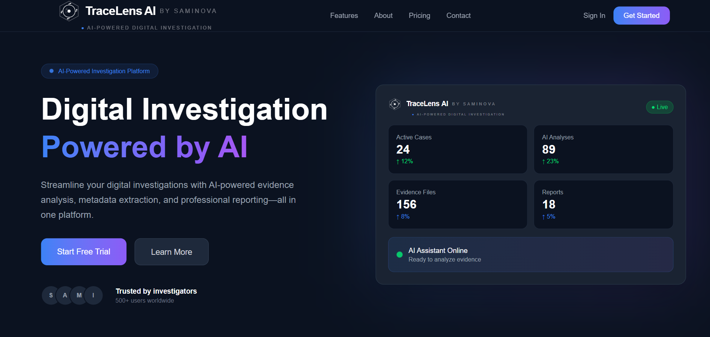 | 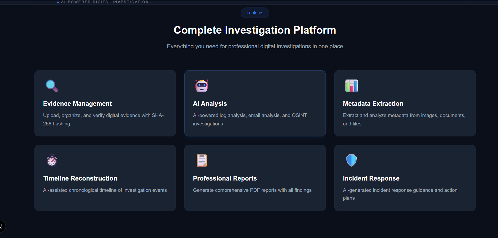 |

| About & Stats | Dashboard Overview |
|---|---|
| 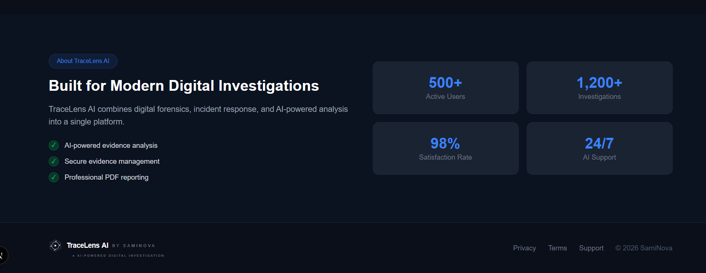 | 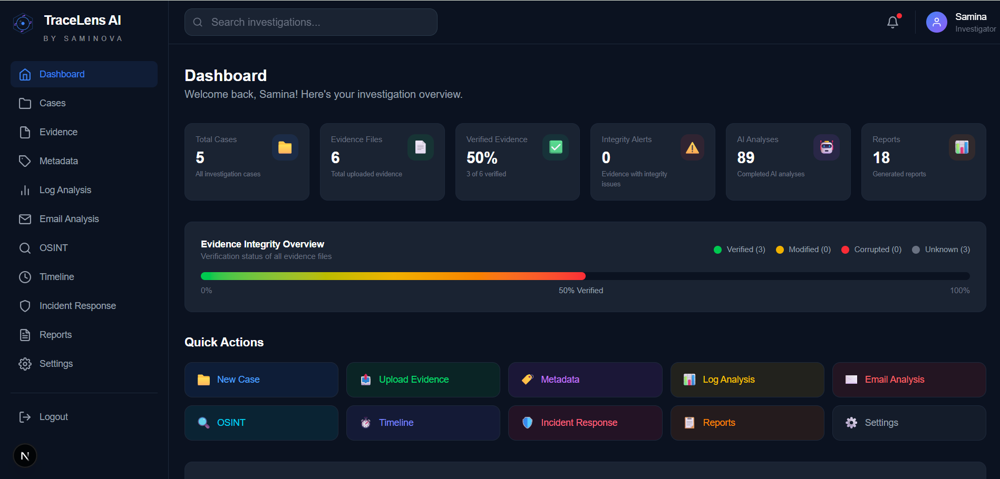 |

### Case & Evidence Management

| New Case | Evidence Upload |
|---|---|
| 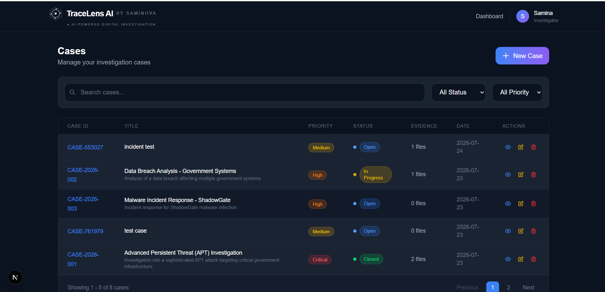 | 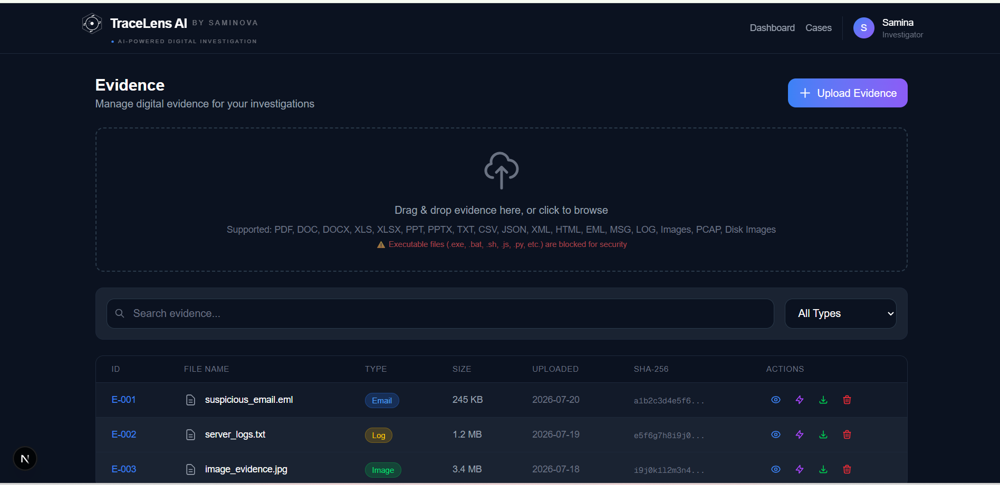 |

| Add Evidence to Case | Metadata Page |
|---|---|
| 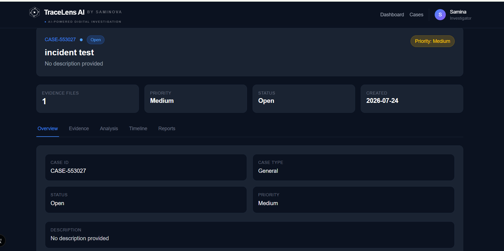 | 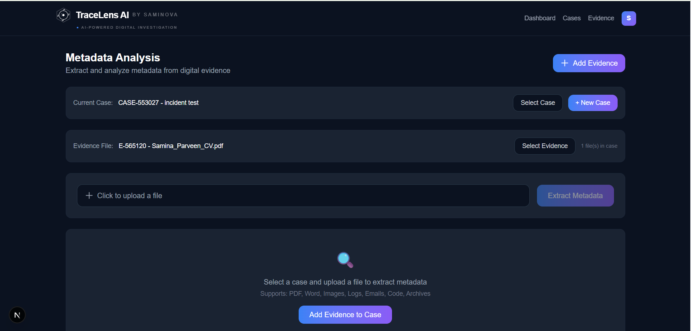 |

### AI Analysis Modules

| Log Analysis | Email Analysis |
|---|---|
| 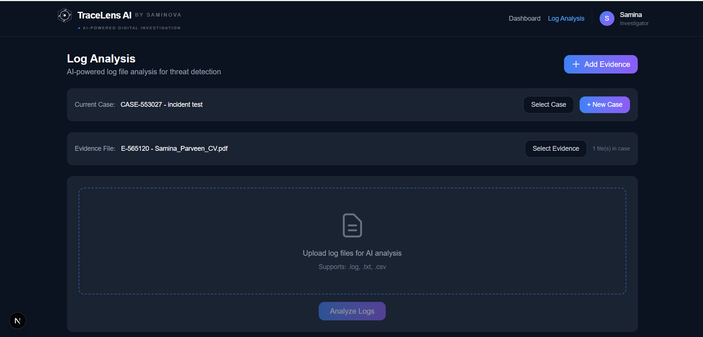 | 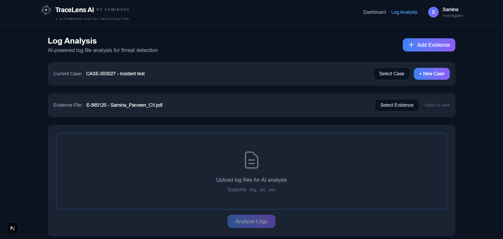 |

| OSINT Analysis | Case Analysis View |
|---|---|
| 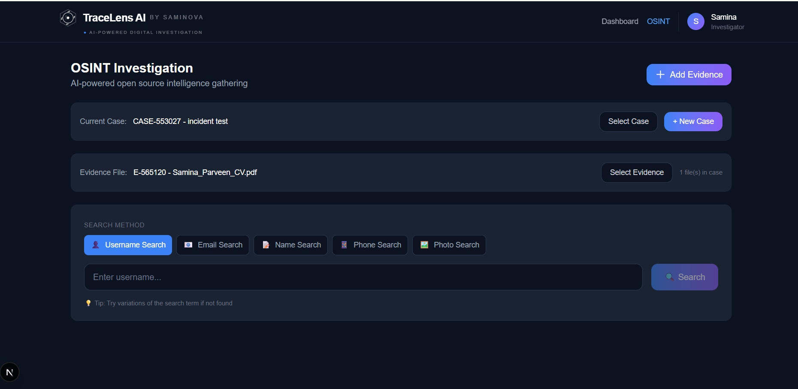 | 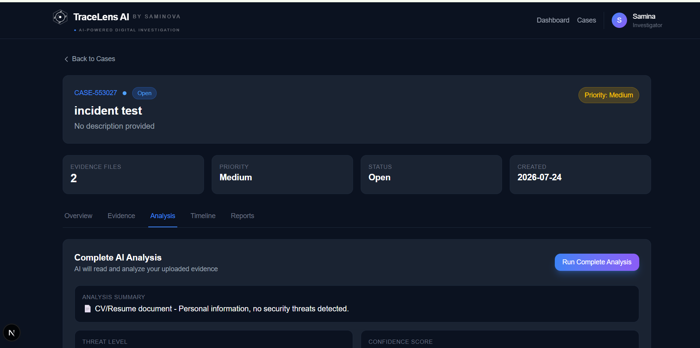 |

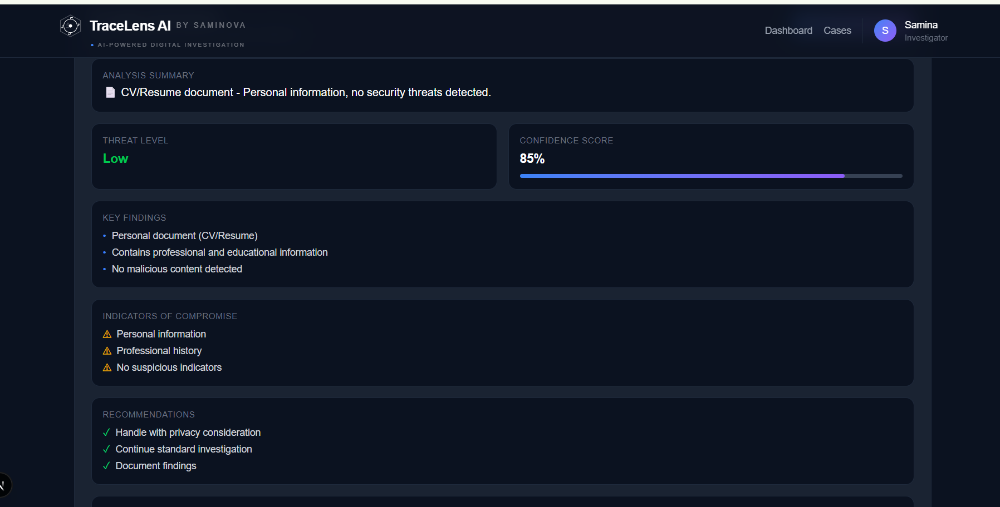
*Structured AI findings — threat level, confidence score, key findings, and recommendations.*

### Timeline & Incident Response

| Investigation Timeline | Timeline Detail |
|---|---|
| 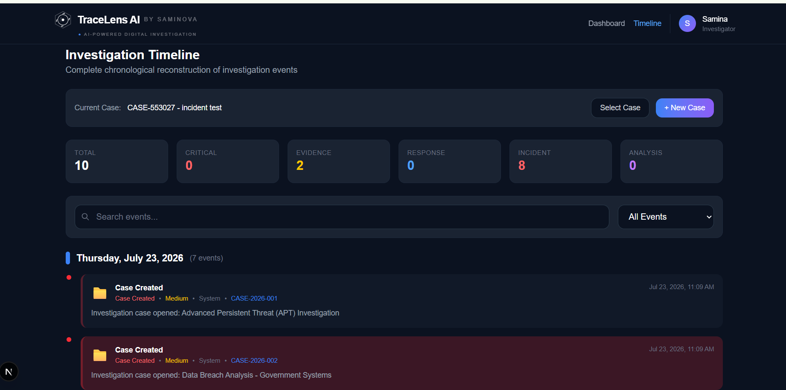 | 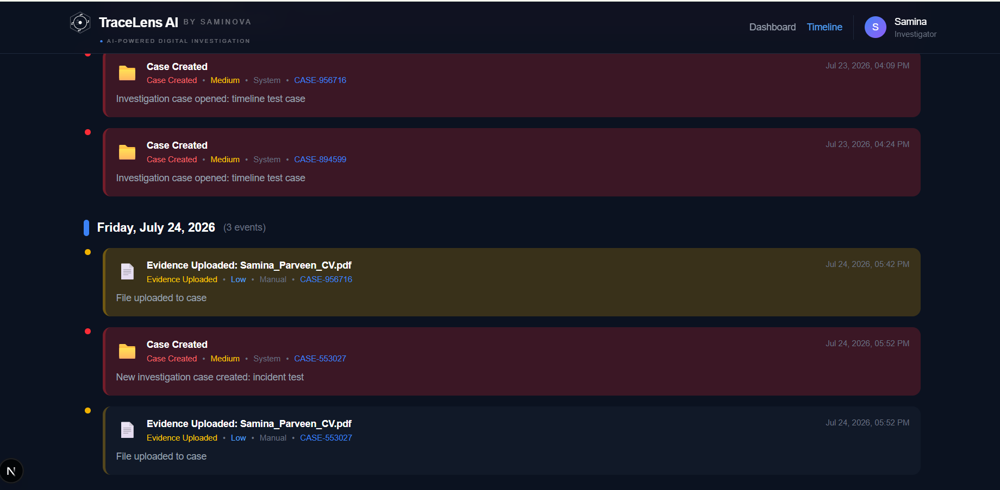 |

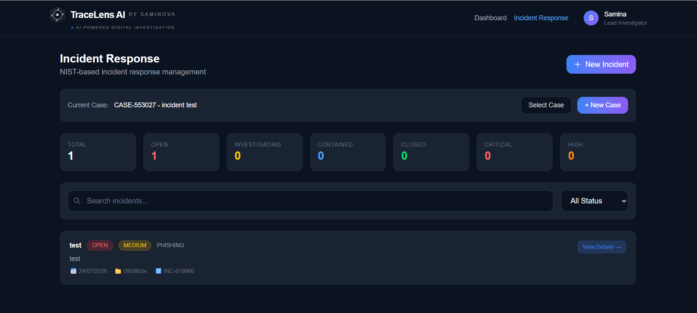
*Structured incident response workflow view.*

### Reporting & Settings

| Reports Page | Select Report Type |
|---|---|
| 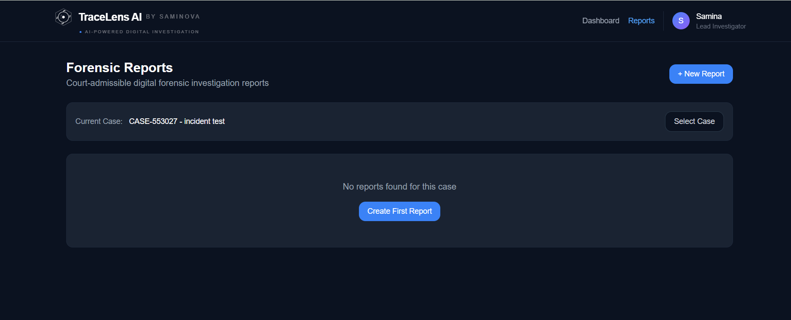 | 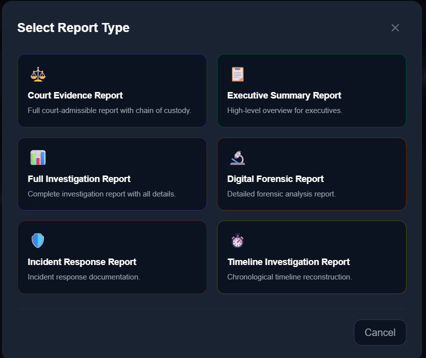 |

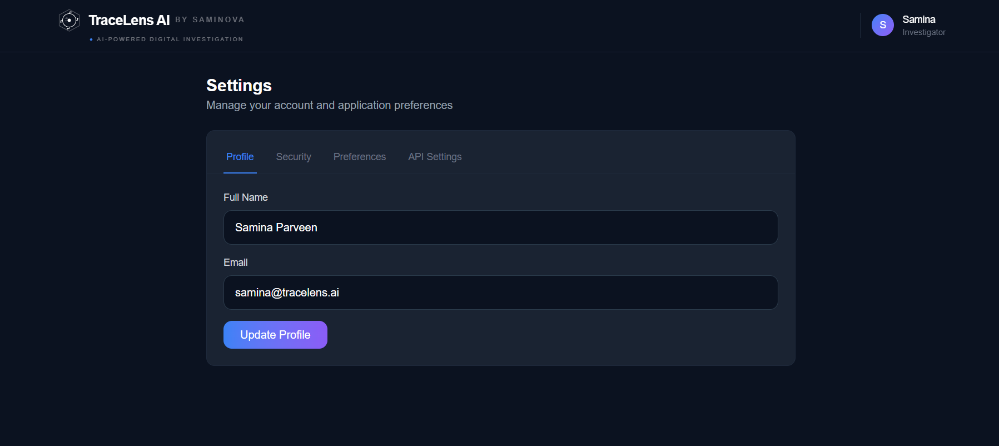
*Organisation and application settings.*

---

## License

TraceLens AI is distributed under the **MIT License**. See the `LICENSE` file for details.

---

## Contact

| Role | Contact |
|---|---|
| Developer | Samina Parveen |
| GitHub | https://github.com/SAMINA-PARVEEN |
| Project Repository | https://github.com/SAMINA-PARVEEN/tracelens-ai |
| Live Application | https://tracelens-ai-one.vercel.app |

---

### Final Notes

TraceLens AI is a fully functional Digital Forensics and Incident Response platform combining modern web technologies (Next.js, React, TypeScript), cloud-native architecture (Supabase, Vercel), artificial intelligence (Grok AI), enterprise security (authentication, RBAC, RLS, auditing), professional court-admissible reporting, and a scalable, modular design across 30+ database tables.

The platform is live and operational, ready for real-world digital forensic investigations.

© 2026 SamiNova — TraceLens AI
